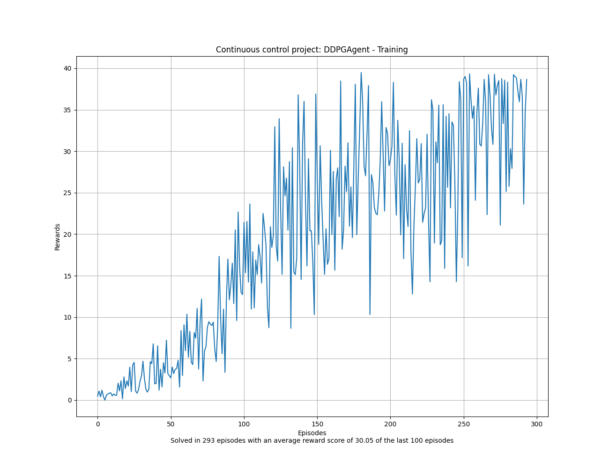
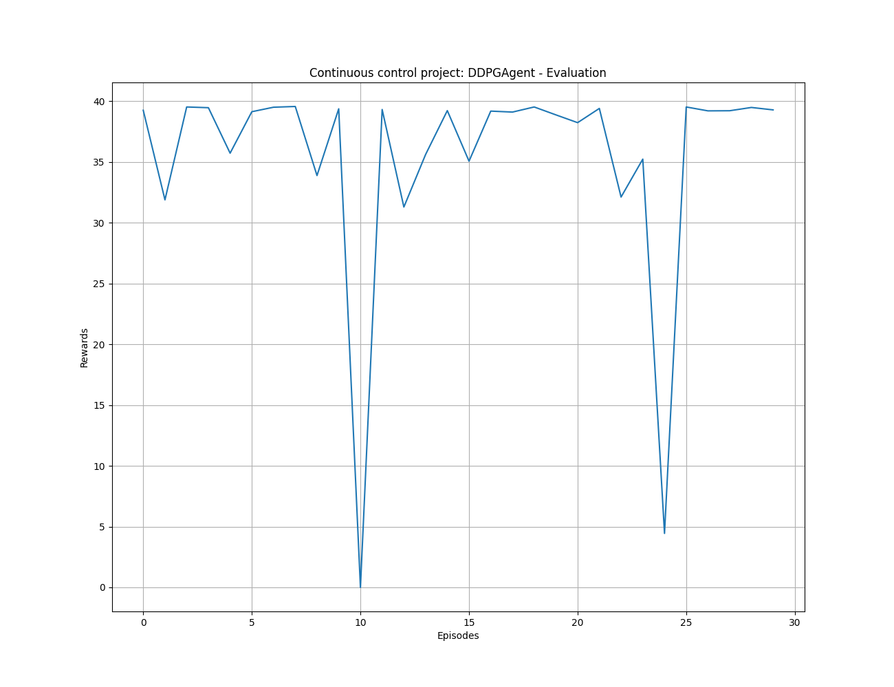

# Project report:  Continuous Control

## Project structure

The code is structured in the following way:

- ``main.py``: This file contains the main code to train and test the agent from the command line using Argparse. It is possible to train the agent from scratch or load a pre-trained model. The code is also able to evaluate the agent in the environment in different modes, e.g., visual and non-visual mode. Please keep in mind that the visual mode is slower than the non-visual mode.

- ``src/agents.py:`` Contains the implementation of the different actor-critic agents as follows:
    - ``DDPGAgent``
    - Others will follow in the future...

- ``src/replay_buffer.py:`` Contains the implementation of the replay buffer that is used by the agents.

- ``src/networks.py:`` Contains the implementation of two different neural networks that are used by the agents. The first one is a simple fully connected network called ``ActorNetwork`` ( $\mu(s|\theta^{\mu})$ ) with Relu activations, Batch Normalization and Adam optimizer. This network maps states to actions and tries to learn a policy directly. The other network called ``CriticNetwork`` ( $Q(s,a|\theta^Q)$ ) is also a simple fully connected network with with Relu activations, Batch Normalization and Adam optimizer. However, the ``CriticNetwork`` is taking both, the state and action, as inputs and tries to learn the state-action-value function Q. While the state is fed into the critic at the very beginning, the action is not included until the 2nd hidden layer. The critic's purpose is to evaluate the resulting action from the actor and therefore evaluating/criticizing the actor's output.

- ``src/noise.py:`` Contains two different classes, namely ``OUActionNoise`` and ``NoNoise``. The first class implements the Ornstein-Uhlenbeck process which adds temporally correlated noise to the action values in order to explore (in DQN that would be equivalent to epsilon-greedy). The authors of the DDPG paper state: *"The Ornstein-Uhlenbeck process models the velocity of a Brownian particle with friction, which results in temporally correlated values centered around 0."* The ``NoNoise`` class is just a convenient way to disable the noise later on when the policy is trained and we want to evaluate. Using this class, the noise is set to 0.0. If we translate that to the DQN case, then setting the noise to 0.0 would be equivalent to setting $\epsilon = 0.00$ in epsilon-greedy. 

- ``src/onnx_export.py:`` Contains a simple function to export the structure of the networks into the onnx format. These files can then be used to create diagrams of the networks via tools like [Netron](https://netron.app/).

## Learning algorithm

### DDPG

The pseudo code for the original DDPG algorithm is as follows:

- Randomly initialize **critic network** $Q(s,a | \theta^Q)$ and **actor** $\mu(s | \theta^{\mu})$ with weights $\theta^{Q}$ and $\theta^{\mu}$.
- Initialize **target network** $Q^{'}$ and $\mu^{'}$ with weights $\theta^{Q^{'}} \leftarrow \theta^{Q}, \theta^{\mu^{'}} \leftarrow \theta^{\mu}$
- Initialize **replay buffer** $R$
- **for** episode = 1, M **do**:
    - Initialize a random process $\mathcal{N}$ for action exploration
    - Receive initial observation state $s_1$
    - **for** $t = 1$, T **do**:
        - Select action $a_t = \mu(s_t | \theta^{\mu}) + \mathcal{N}_t$ according to the current policy and exploration noise
        - Execute action $a_t$ and observe reward $r_t$ and observe new state $s_{t+1}$
        - Store transition $(s_t,a_t,r_t,s_{t+1})$ in $R$
        - Sample a random minibatch of $N$ transitions $(s_i,a_i,r_i,s_{i+1})$ from $R$
        - Set $y_i = r_i + \gamma Q^{'}(s_{i+1}, \mu^{'}(s_{i+1} | \theta^{\mu^{'}}) | \theta^{Q^{'}})$
        - Update critic by minimizing the loss (MSE): $L = \frac{1}{N} \sum_i (y_i - Q(s_i,a_i | \theta^Q))^2$
        - Update the actor policy using the sampled policy gradient (using the Deterministic Policy Gradient Theorem (Silver et al. 2014)):

        $$\nabla_{\theta^{\mu}} J \approx \frac{1}{N} \sum_i \nabla_a Q(s,a | \theta^Q) \vert_{s=s_i, a=\mu(s_i)} \nabla_{\theta^{\mu}} \mu(s | \theta^{\mu})\vert_{s_i}$$ 

        - Update the target networks:

        $$\theta^{Q^{'}} \leftarrow \tau \theta^Q + (1 - \tau)\theta^{Q^{'}}$$
        $$\theta^{\mu^{'}} \leftarrow \tau \theta^{\mu} + (1 - \tau) \theta^{\mu^{'}}$$
    - **end for**
- **end for**

Deep Deterministic Policy Gradients (DDPG) is a model-free, off-policy RL algorithm that is combing the ideas of DQNs (replay buffer, uniform sampling of the buffer and target Q-networks) with the actor-critic architecture, the Deterministic Policy Gradient Theorem from DPG and the idea of Batch normalization.

**Training the critic**

- Same idea as in DQN, but for actor-critic rather than Q-Learning
- To train the critic, you use the same tricks as DQN with target networks and replay buffer shuffling. For the target network in contrast to DQN, we are not updating the target network after a number of steps but with soft updates (polyak averaging) and using hyperparameter $\tau$.

**Training the actor**

- Deterministic policy gradient theorem: the true policy gradient is

$$\nabla_{\mu} \pi(s,a) = \mathbb{E}_{\rho(s)} [\nabla_a Q(s,a | \theta) \nabla_\mu \pi(s | \mu)]$$

- The intuition behind this theorem is the following: Assume that you use a specific state as input for the actor, the actor then proposes a specific action for that state as output. The output of the actor together with the given state is then used as input for the critic. The critic then evaluates the action by producing a certain Q-value for that state-action pair. To improve your actor, you can take a slightly different action than before and check if the Q-value of the critic is getting better or worse. However, you do this by taking the gradient of the Q-value with respect to the action (check if taking another action is making the Q-value better or worse). You backpropagate the gradient of the Q-value with respect to the action(s) that then produces an error. The actor is then trained by using this error as the loss function. Note: In the beginning you probably have to train your critic faster than your actor.

- $\nabla_a Q(s,a | \theta)$ is used as error signal to update the actor weights
    - $\nabla_a Q(s,a | \theta)$ is a gradient over **actions**
- $y = f(w * x + b)$ (symmetric roles of weights and inputs). We can take the gradient with respect to the weights $w$ but also with respect to the actions $x$
- Gradient over actions $\sim$ gradient over weights

**Exploration**

Exploration is done using the Ornstein-Uhlenback noise process (correlated, where the noise of the next steps depends on the noise of the previous noise) but Gaussian noise also seems to work well. Adding noise to the actions in DDPG is equivalent to using epsilon-greedy for the DQN algorithm.

### Hyperparameters

The following **hyperparamters** have been used for the DDPG agent:

| Name   | Value  |
|---|---|
| Alpha/Learning rate for actor | 0.0001  |
| Beta/Learning rate for critic | 0.0001  |
| Gamma/discount factor  | 0.99  |
| (Replay) Buffer size  | 1000000 |
| Batch size  | 128 |
| Tau/Update target networks (percentage)  | 0.001 |
| Adam optimizer weight decay (not part of argparse arguments)  | 0.0 |

Before mentioned values are also the default values for the ``main.py`` script. Therefore, you don't have to specify them explicitly if you want to reproduce the results.

### Model architecture

In order to understand the model architecture it is useful to understand the general idea behing actor-critic algorithms. The following paragraph has been taken from the book "Reinforcement Learning - An Introduction" by Sutton and Barto: 

*Actor-critic algorithms learn both policies and value functions. The 'actor' is the component that learns policies, and the 'critic' is the component that learns about whatever policy is currently being followed by the actor in order to 'criticize' the actor's action choices. The critic uses a TD algorithm to learn the state-value function for the actor's current policy. The value function allows the critic to critique the actor's action choices by sending TD errors, $\delta$, to the actor. A positive $\delta$ means that the action was 'good' because it led to a state with a better-than-expected value; a negative $\delta$ means that the action was 'bad' because it led to a state with a worse-than-expected value. Based on these critiques, the actor continually updates its policy*.

**ActorNetwork**

The ``ActorNetwork`` ( $\mu(s|\theta^{\mu})$ ) maps states to actions and therefore tries to directly learn a policy. It is a simple three-layer fully connected network with Rectified Linear Unit (ReLU) activations, Batch Normalization (in our implementation, it is LayerNorm though) and Adaptive Moment Estimation (Adam) optimizer which is an extension of stochastic gradient descent. The input layer is fully-connected/dense and has 33 nodes for the 33 features with 128 output nodes. The first layer is followed by Batch Normalization (LayerNorm) and after that followed by a ReLU activation. This layer-structure is repeated one more time where the second fully-connected/dense layer has 128 input nodes and 128 output nodes and is also followed by Batch Normalization and then with a ReLU activation. The third fully-connected/dense layer (called $\mu$ ) has 128 input nodes and 4 output nodes for every possible action. The output of the last layer is followed by an hyperbolic tangent (tanh) activation to restrict the output into a range of [-1,1]. The network is implemented in ``src/networks.py``.

The following figure shows the network architecture:

Note: ``Gemm`` stands for General matrix multiplication (dense layer/fully connected layer).

**CriticNetwork**

The ``CriticNetwork`` ( $Q(s,a|\theta^Q$ ) maps state-action pairs to Q-values and therefore tries to learn the state-action value function Q. It is a simple four-layer fully connected network with Rectified Linear Unit (ReLU) activations, Batch Normalization (in our implementation, it is LayerNorm though) and Adaptive Moment Estimation (Adam) optimizer which is an extension of stochastic gradient descent. In the original DDPG paper the authors state: *"For Q we included L2 weight decay of 10−2"*. However, in our implementation the weight decay has been set to 0.0.
The input layer is fully-connected/dense and has 33 nodes for the 33 features with 128 output nodes. The first layer is followed by Batch Normalization (LayerNorm) and after that followed by a ReLU activation. 
After that, the second fully-connected/dense layer follows with 128 input nodes and 128 output nodes. This layer is followed by Batch Normalization (LayerNorm) again but without the ReLU activation.
The third fully-connected/dense layer (you can also call it the second hidden-layer) has 4 input nodes for every possible action and 128 output nodes. This layer does not take any pre-processed input from the other layers but represents the point where the action is finally fed into the CriticNetwork given that the authors of the DDPG paper state: *"Actions were not included until the 2nd hidden layer of Q."*
We therefore end up with a state-value given by the output of the last second fully-connected layer and with an action-value calculated by the third fully-connected layer (second hidden layer). Both the state- and the action-value have 128 entries and are then combined by addition which results in an state-action-value. This combined state-action-value is fed into the last fully-connected/dense layer which has 128 input nodes and one single output node that represent the Q-value of this state-action-value.
The network is implemented in ``src/networks.py``.

The following figure shows the network architecture:

**DDPGAgent**

The class ``DDPGAgent`` found in ``src/agents.py`` combines the following components:

- ``ActorNetwork``:  $\mu(s|\theta^{\mu})$  
- ``Target ActorNetwork``: $\mu^{'}(s | \theta^{\mu^{'}}) )$
- ``CriticNetwork``: $Q(s,a|\theta^Q$ 
- ``Target CriticNetwork``: $Q^{'}(s,a|\theta^{Q^{'}})$ 
-  ``Replay buffer``: $R$
- ``OUActionNoise``: Ornstein-Uhlenbeck noise (an alternative would be Gaussian noise)

All updates are done using the Adam optimizer and the mean squared error (MSE) loss. Moreover, the agent performs so called "soft-updates" to both target networks using the hyperparameter $\tau$ as follows:

$$\theta^{Q^{'}} \leftarrow \tau \theta^Q + (1 - \tau)\theta^{Q^{'}}$$
$$\theta^{\mu^{'}} \leftarrow \tau \theta^{\mu} + (1 - \tau) \theta^{\mu^{'}}$$

These kind of soft-updates to the target networks are also called "polyak averaging" or "polyak updates" and are implemented in the method ``update_network_parameters`` of the ``DDPGAgent`` class.

## Plot of rewards

The DDPG agent for the one-agent environment (version 1) was able to solve the continuous control problem with an average score of 30+ over 100 consecutive episodes after 293 episodes. See the following plots for the training and evaluation of the agent.

### DDPG

Training plot of the **DDPG algorithm**: 

Evaluation of the trained **DDPG agent** over 30 episodes with deterministic behavior:

## Ideas for future work

- Using PPO/A3C/A2C for the multi agent environment
- Prioritized Experience replay
- Parameter noise (noise to the network weights) instead of action noise (noise to the action output)
- Gaussian noise instead of Ornstein-Uhlenbeck noise
- Using several actors and/or several critics
- Experimenting with Adam weight decay and the effect on training stability