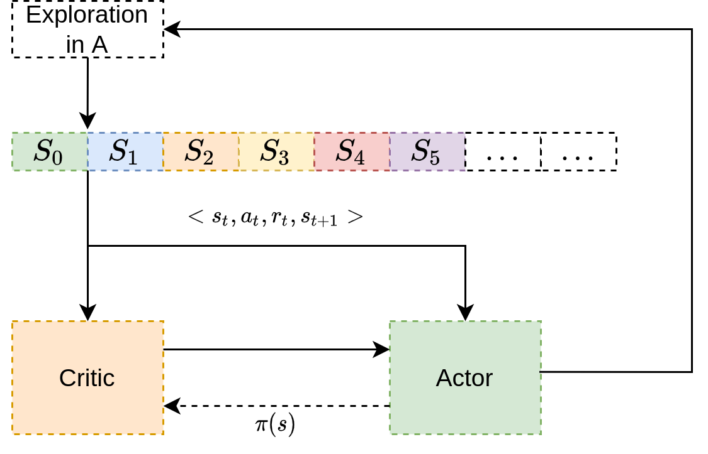
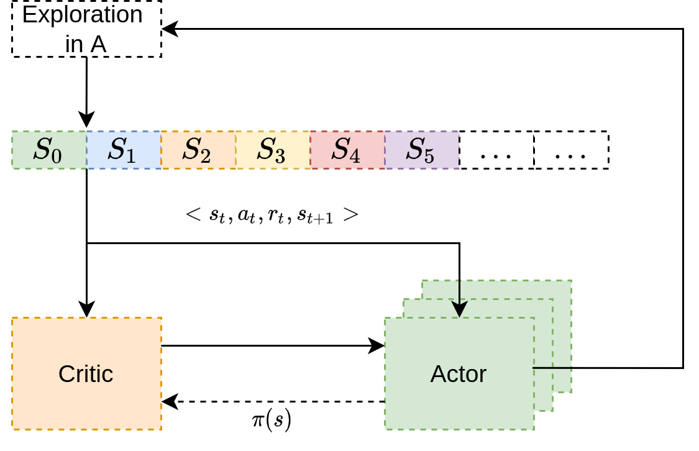

# Project report:  Continuous Control

## Project structure

The code is structured in the following way:

## Learning algorithm

### DDPG

Deep Deterministic Policy Gradients (DDPG) is a model-free, off-policy RL algorithm that is combing the ideas of DQNs (replay buffer, uniform sampling of the buffer and target Q-networks) with the actor-critic architecture, the Deterministic Policy Gradient Theorem from DPG and the idea of Batch normalization.

**General architecture**

- Actor $\pi_{\mu}$ 
- Critic $Q(s_t, a_t | \theta)$
- All updates are based on Stochastic Gradient Descent (SGD)
- Adaptive gradient descent techniques tune the step size (RProp, RMDProp, Adagad, Adam,...)

**Training the critic**

- Same idea as in DQN, but for actor-critic rather than Q-Learning
- Minimize the RPE (reward predicition error, TD error): $\delta_t = r_t + \gamma Q(s_{t+1}, \pi(s_{t+1}) | \theta) - Q(s_t, a_t | \theta)$
    - Note: $\pi(s_{t+1})$ means we are using the proposed action of the actor and not the action from the replay buffer sample
- Given a minibatch of N samples $\{ s_i, a_i, r_i, s_{i+1}\}$ and a target network $Q'$, compute $y_i = r_i + \gamma Q'(s_{i+1}, \pi(s_{i+1})|\theta')$
- And update $\theta$ by minimizing the (squared) loss function:

$$L = \frac{1}{N} \sum_i (y_i - Q(s_i,a_i | \theta))^2$$

- Note: To train the critic, you use the same tricks as DQN with target networks and a replay buffer shuffling. For the target network in contrast to DQN, we are not updating the target network after a number of steps but with soft updates (polyak averaging?)and using hyperparameter $\tau$.

**Training the actor**

- Deterministic policy gradient theorem: the true policy gradient is

$$\nabla_{\mu} \pi(s,a) = \mathbb{E}_{\rho(s)} [\nabla_a Q(s,a | \theta) \nabla_\mu \pi(s | \mu)]$$

- The intuition behind this theorem is the following: Assume that you use a specific state as input for the actor, the actor then proposes a specific action for that state as output. The output of the actor together with the given state is then used as input for the critic. The critic then evaluates the action by producing a certain Q-value for that state-action pair. To improve your actor, you can take a slightly different action than before and check if the Q-value of the critic is getting better or worse. However, you do this by taking the gradient of the Q-value with respect to the action (check if taking another action is making the Q-value better or worse). You backpropagate the gradient of the Q-value with respect to the action(s) that then produces an error. The actor is then trained by using this error as the loss function. Note: In the beginning you probably have to train your critic faster than your actor?

- $\nabla_a Q(s,a | \theta)$ is used as error signal to update the actor weights
    - $\nabla_a Q(s,a | \theta)$ is a gradient over **actions**
- Comes from NFQCA
- $y = f(w * x + b)$ (symmetric roles of weights and inputs). We can take the gradient with respect to the weights $w$ but also with respect to the actions $x$
- Gradient over actions $\sim$ gradient over weights

**Off-policy**

- The actor update rule is 

$$\nabla_w \pi(s_i) \approx \frac{1}{N} \sum_i \nabla_a Q(s,a | \theta) |_{s=s_i, a = \pi(s_i)} \nabla_w \pi(s)|_{s=s_i}$$
- The action from the actor is used:
    - To compute the target value $y_i = r_i + \gamma Q'(s_{i+1}, \pi(s_{i+1})| \theta')$
    - To update the actor
- As we have seen, actor-critic is off-policy, but convergence is fragile

**Parallel updates**

- Updating the critic and the actor can be done in parellel
- One may use several actor, several critic,...
- Other state-of-the-art methods: Gorila, IMPALA: parallel implementations without replay buffers

**Exploration**

- Adding to the action an Ornstein-Uhlenback (correlated, where the noise of the next steps depends on the noise of the previous noise) noise process or Gaussian noise
- Action perturbation (versus parameter perturbation, cf. e.g. Plapper or Fortunato, Noisy DQN)
- Several actors explore more

### Hyperparameters

### Model architecture

## Plot of rewards

## Ideas for future work

- Prioritized Experience replay
- Parameter noise instead of action noise
- Parallel actors